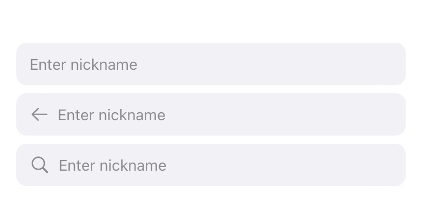

# SDSwiftUIPack

This package is a collection of useful tools for SwiftUI views.

## Requirements

iOS 15.0

## Installation

### Swift Package Manager

```swift
/// Package.swift
/// ...
dependencies: [
    .package(url: "[https://github.com/SwiftUIX/SwiftUIX.git](https://github.com/sanhee16/SDSwiftUIPack.git)", branch: "main"),
]
/// ...
```

## Usage  

### Font

The font has been defined using the system font along with size and weight. You can combine sys + size + weight for usage. The size ranges from 10 to 50, and the weight options are bold, medium, and regular. For example, system font + size 40 + regular would be .sys40r.
```swift
extension Font {
    public static let sys40b: Font = .system(size: 40, weight: .bold)
    public static let sys40m: Font = .system(size: 40, weight: .medium)
    public static let sys40r: Font = .system(size: 40, weight: .regular)
}
```
```swift
Text("Hello, SDSwiftUIPack!")
    .font(.sys40r)
```

You can also set both the font and color simultaneously.
```swift
Text("Hello, SDSwiftUIPack!")
    .sdFont(.sys30b, color: .green)
```


  
### View
Padding can be easily specified using only CGFloat. You can set padding for top, leading, trailing, and bottom, or specify padding for all edges, horizontal, or vertical.
```swift
Text("Hello, SplashView!")
    .sdPaddingTop(10)
    .sdPaddingBottom(10)
    .sdPaddingLeading(10)
    .sdPaddingTrailing(10)
    .sdPaddingHorizontal(10)
    .sdPaddingVertical(10)
    .sdPaddingpadding(top: 10, leading: 10, bottom: 10, trailing: 10)
```


  
### SearchBar
You can use a Searchbar with various designs. Additionally, you can easily handle changes to the search bar’s text through modifiers such as onChange, onSearch, and onRemoveAll.  

```swift
SearchBar("Enter nickname", text: $nickname, type: .none)
SearchBar("Enter nickname", text: $nickname, type: .back(onClickBack: {
    print("back!")
}))
SearchBar("Enter nickname", text: $nickname, type: .search)
    .onSearch { newValue in
        print("onSearch: \(newValue)")
    }
    .onChange { newValue in
        print("onChange: \(newValue)")
    }
    .onRemoveAll {
        print("onRemoveAll")
    }
```


## Author

sanhee16, sinhioa20@gmail.com
